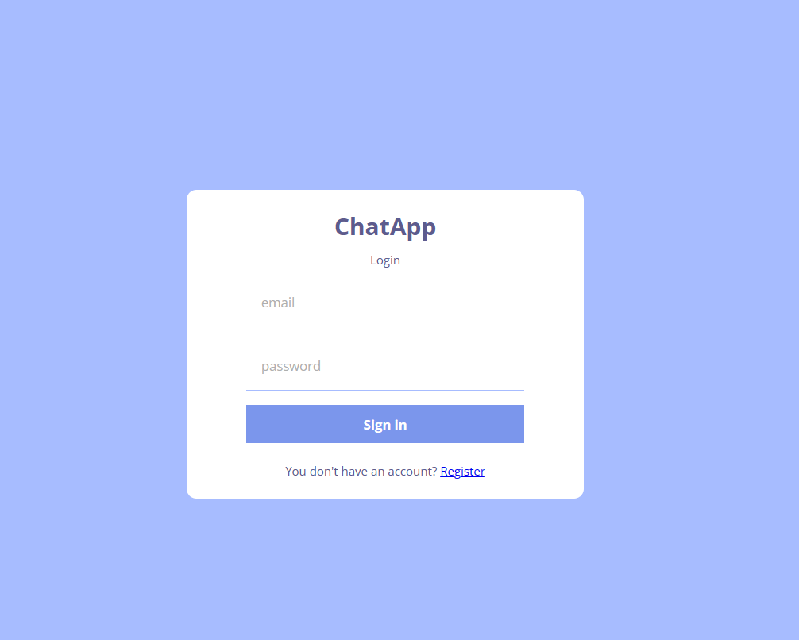
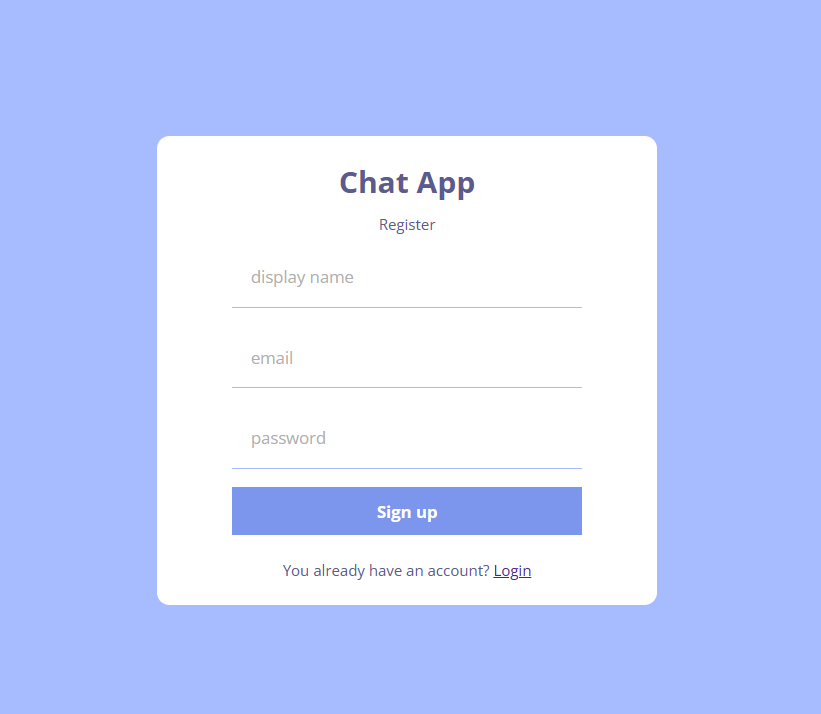
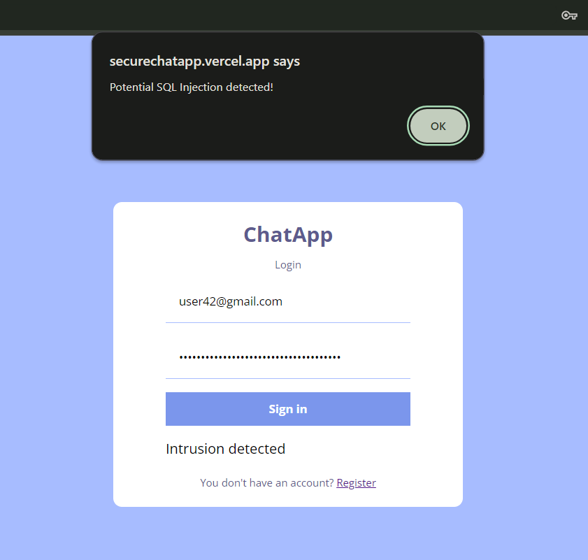
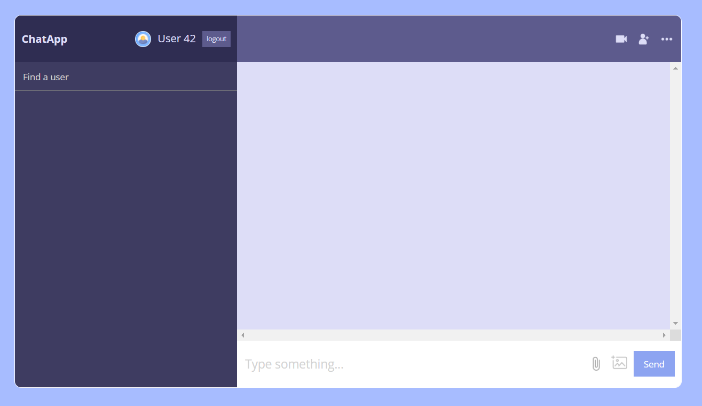
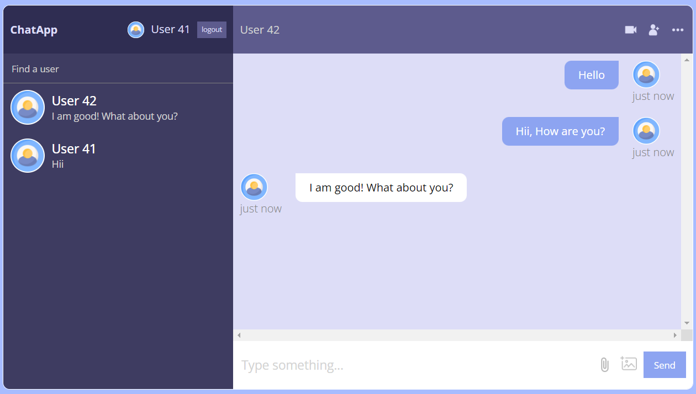
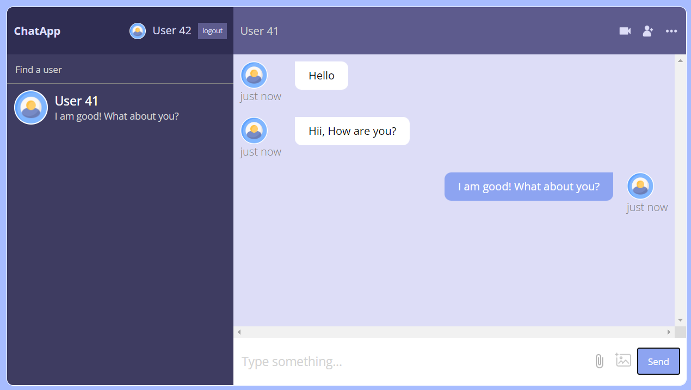

# ChatApp

ChatApp is an End-to-End Encrypted Chat Application with Intrusion Detection which authenticates users and verifies them users can send messages to each another which is secured (SHA256+AES+Salting) and stores data in database (Firebase). It provides a platform for users to communicate privately and securely.

## Features

- **End-to-End Encryption**: All messages sent through ChatApp are encrypted to ensure the highest level of privacy and security.

- **Intrusion Detection**: ChatApp incorporates intrusion detection mechanisms to detect and prevent unauthorized access and suspicious activity.

- **User Authentication**: Secure user authentication is managed using Firebase Authentication.

- **Real-Time Messaging**: Messages are sent and received in real time, providing a seamless and responsive chat experience.

- **Firebase Backend**: The application's backend is powered by Firebase, offering a scalable and reliable cloud infrastructure.

- **User-Friendly Interface**: ChatApp is designed with a clean and intuitive user interface for an exceptional user experience.

## Technologies Used
 HTML, CSS, JavaScript, Node.js, React.js, CryptoJS, Python, Flask, Firebase, GCP.
## Screenshots

